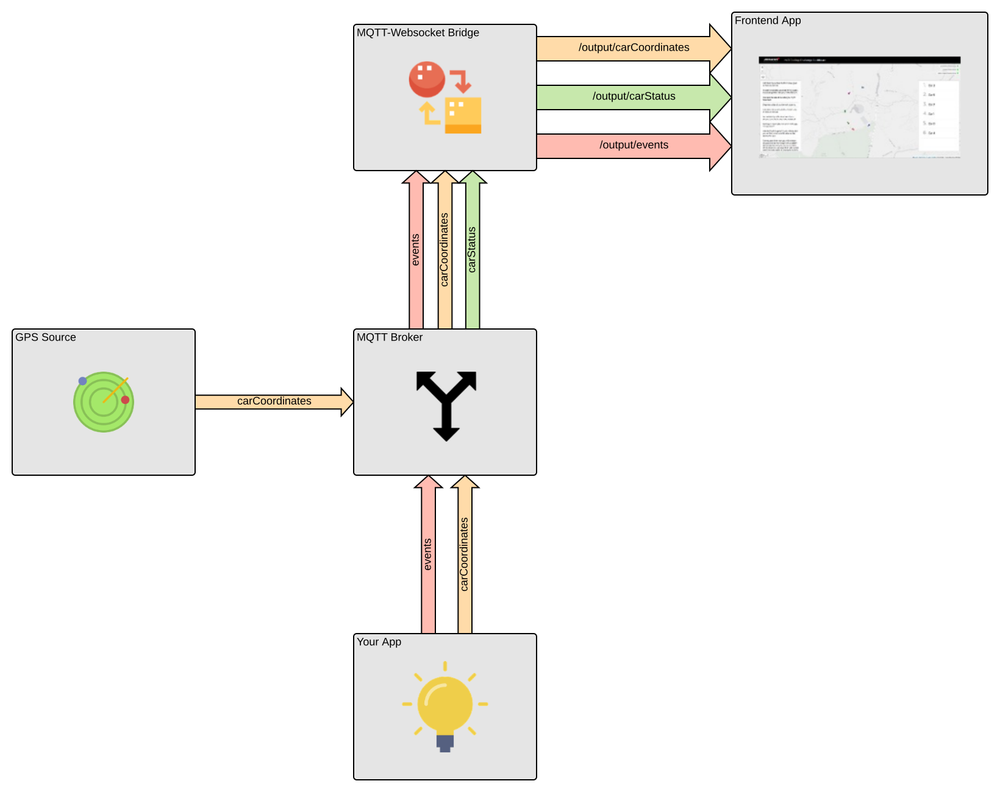

# MAT Fan Engagement Coding Challenge

## Prerequisites:

* [docker](https://docs.docker.com/)
* [docker-compose](https://docs.docker.com/compose/)

## Introduction

The purpose of this challenge is for you to demonstrate
* Document how to run and test your deployment.
* The development of a MQTT client that subscribes to telemetry, receives the data, and stores them in a data store.
* Configuration Management code (e.g. Puppet/Chef/Ansible) and/or Dockerfile(s) or equivalent code that deploys:
  * a suitable storage medium (your data store)
  * the MQTT data archiver you wrote in an appropriate language of your choice
  * any additional service you think is appropriate for such a platform
* A public cloud deployment plan

Feel free to use any libraries, frameworks or dependencies you want in order to achieve the task.

Please include instructions on how to build and run your code, any tests you've written and some text explaining what you did.

If you are already familiar with the underlying technologies we hope that it won't take you more than a couple of hours to get your application up and running.

## Scenario

Real-time data from a Formula 1 race has been recorded and streamed into our system. We want to use that data in order to increase fan engagement by providing a live visualisation.

## Challenge

Raw telemetry data is arriving via MQTT. A basic front-end application has been developed to visualise F1 cars going around a track. It can also display an event stream and car status information such as speed and position, but currently it is not receiving this information.

Please develop a data storage application which subscribes to the provided MQTT broker and consumes data from the following MQTT topic with the format shown and stores them to a meaningful medium.
Additionally please provide on the README file a strategy of deploying this solution to the public cloud provider of your choice.

* **carCoordinates**

    ```console
      {
        timestamp: number,
        carIndex: number,
        location: {
          lat: float,
          long: float
         }
      }
    ```

  e.g.

    ```json
      {
        "timestamp": 1541693114862,
        "carIndex": 2,
        "location": {
          "lat": 51.349937311969725,
          "long": -0.544958142167281
         }
      }
    ```

It should then publish aggregated and enriched data on the following MQTT topics using the format described:

- **carStatus**

    ```console
      {
        timestamp: number,
        carIndex: number,
        type: string<SPEED|POSITION>,
        value: number
      }
    ```

  e.g.

    ```json
      {
        "timestamp": 1541693114862,
        "carIndex": 2,
        "type": "POSITION",
        "value": 1
      }
    ```

- **events**

    ```console
      {
        timestamp: number,
        text: string
      }
    ```

  e.g.

    ```json
      {
        "timestamp": 1541693114862,
        "text": "Car 2 races ahead of Car 4 in a dramatic overtake."
      }
    ```

All these topics will then be forwarded via a gateway-like MQTT-to-WebSocket service to the frontend application.

## Architecture



## Getting started

Start all components:

```console
$ docker-compose pull
$ docker-compose up -d
Creating network "mat-coding-challenge_default" with the default driver
Creating broker ... done
Creating source_gps        ... done
Creating mqtt-to-websocket ... done
Creating webapp            ... done
```

Open (http://localhost:8084)

Test the setup with `mosquitto_pub` or a similar MQTT client:

```console
$ mosquitto_pub -t events -f examples/event.json
$ mosquitto_pub -t carStatus -f examples/position.json
$ mosquitto_pub -t carStatus -f examples/speed.json
```

You should now see a car's position and an event in the webapp.
